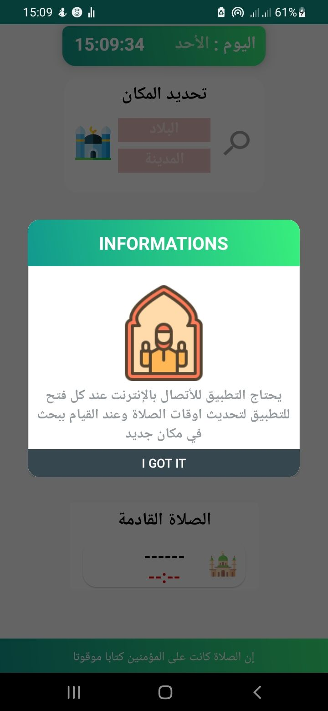
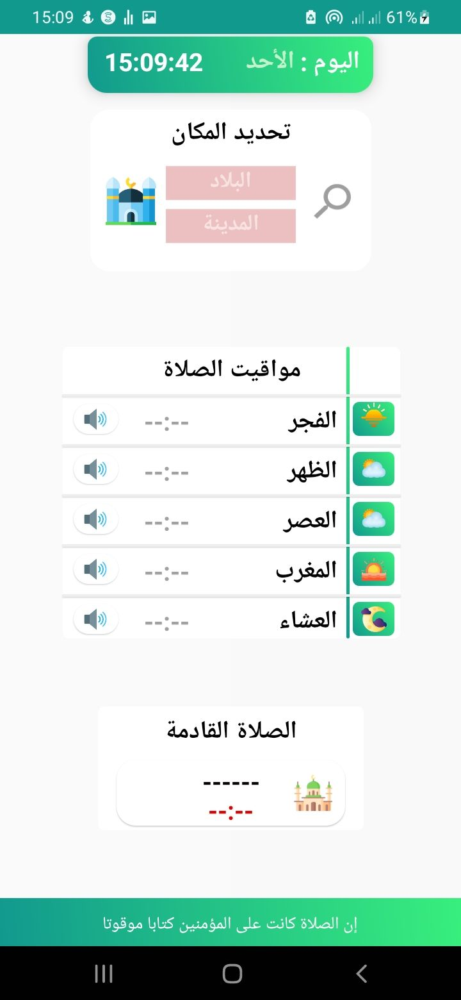
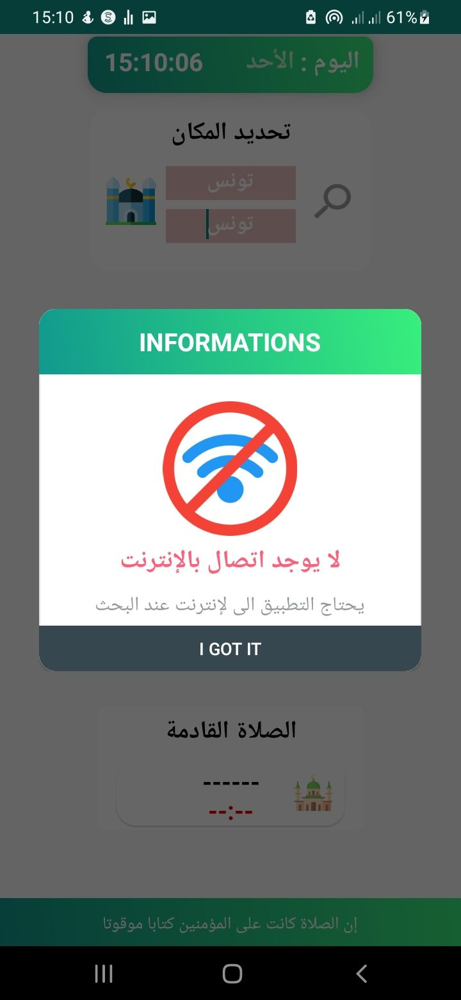
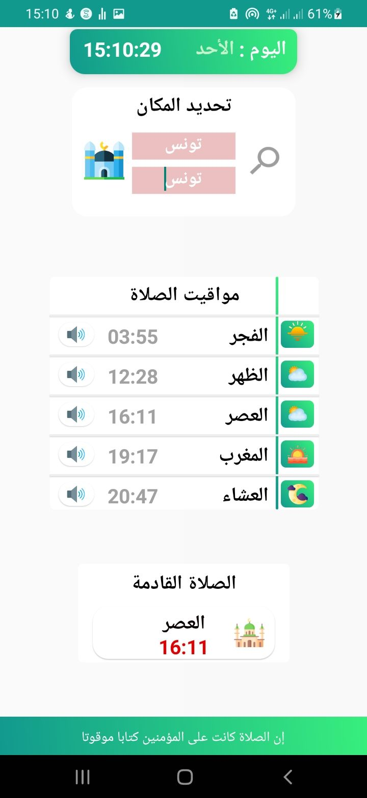

<h1 align="center"> PrayerTimes 🕌 </h1>
This is a muslim ☪️️ prayer times 🕌 app 📱 according to any location in the world 🌎.
 
😇" API based on : https://aladhan.com "😇  
 

    

     
      
      
      
       
    

(<a href="#top">back to top</a>)

